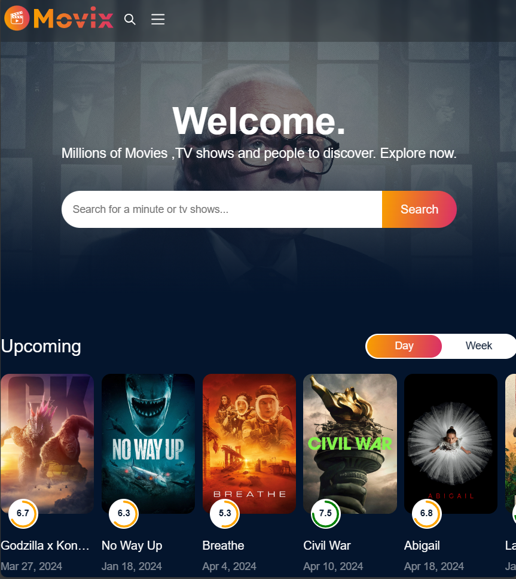
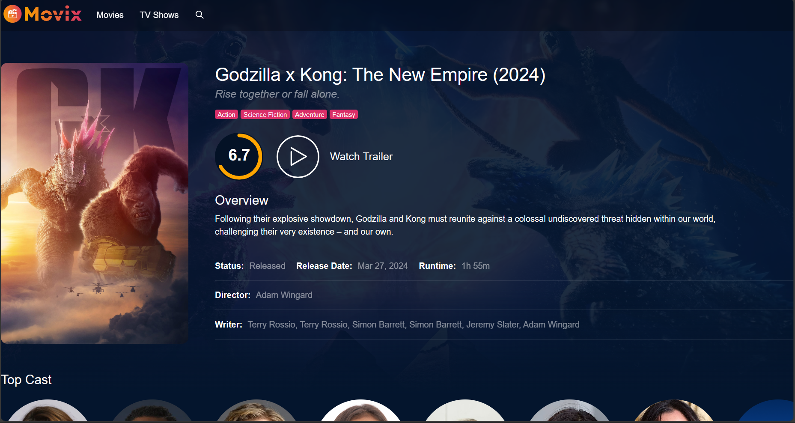

# Movix: Your Ultimate Movie Companion

Welcome to Movix, your all-in-one destination for everything related to movies! Movix is a web application inspired by popular platforms like IMDb, designed to provide users with a seamless and immersive movie experience.
 
## Demo:

## Key Features:
- **Comprehensive Database:** Explore an extensive collection of movies, TV shows, and documentaries. From the latest releases to timeless classics, Movix has it all.
- **User-Friendly Interface:** Our intuitive interface makes it easy to search for titles, read reviews, and discover new favorites.
- **Personalized Recommendations:** Receive personalized movie recommendations based on your viewing history and preferences.
- **Responsive Design:** Enjoy a seamless experience across devices, from desktops to smartphones.

## Technologies Used:
- **Frontend:** React.js, SASS
- **Backend:** Node.js, Express.js
- **APIs:** [TMDB](https://developer.themoviedb.org/docs/getting-started)
- **Additional Tools:** React Router, Redux, Axios

## Contributing
I welcome contributions and feedback from the community. If you'd like to contribute to this repository.

## Contact
Connect with me on social media:
- Twitter: [@devhimanshuu](https://twitter.com/devhimanshuu)
- LinkedIn: [Himanshu Gupta](https://www.linkedin.com/in/himanshu-guptaa/)
- Email: devhimanshuu@gmail.com
- Hashnode: [TechSphere](https://techsphere.hashnode.dev/)

Feel free to reach out if you have questions, suggestions, or just want to chat about Movix

Happy coding! 🚀
